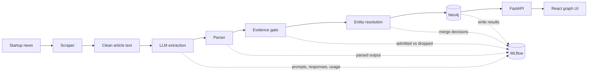
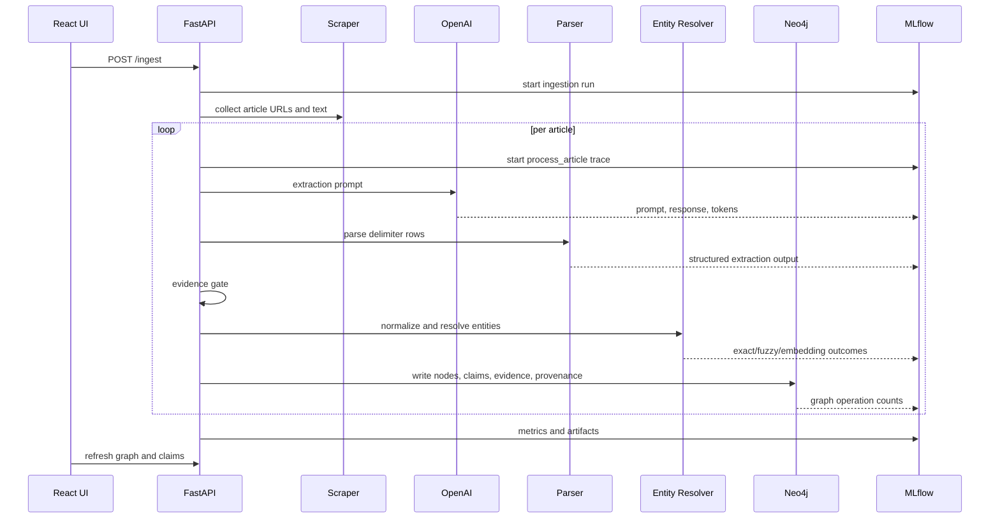
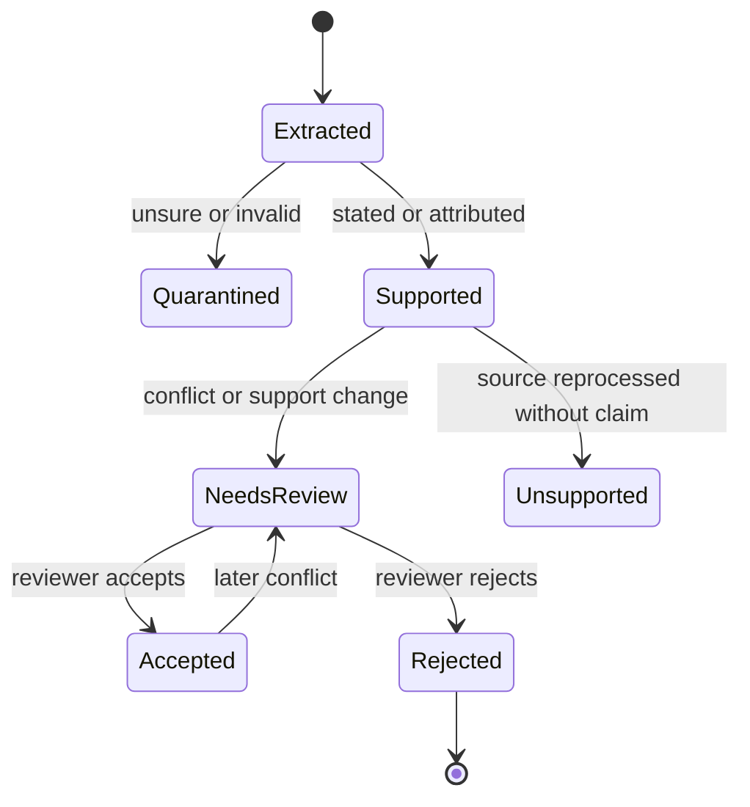
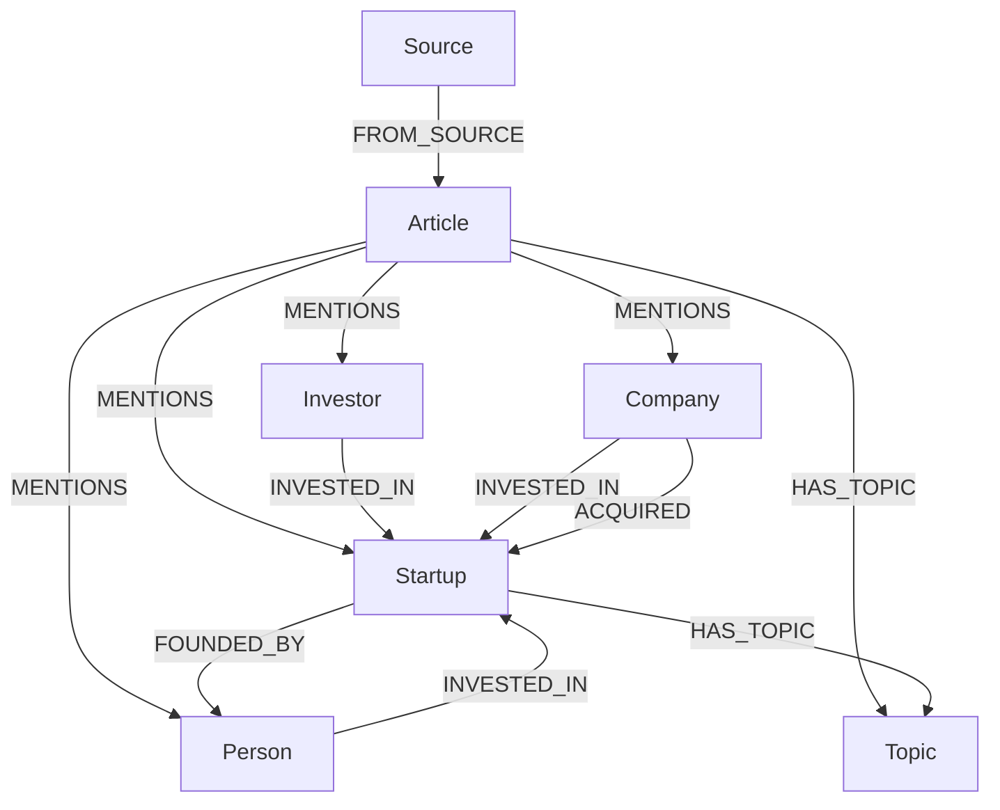
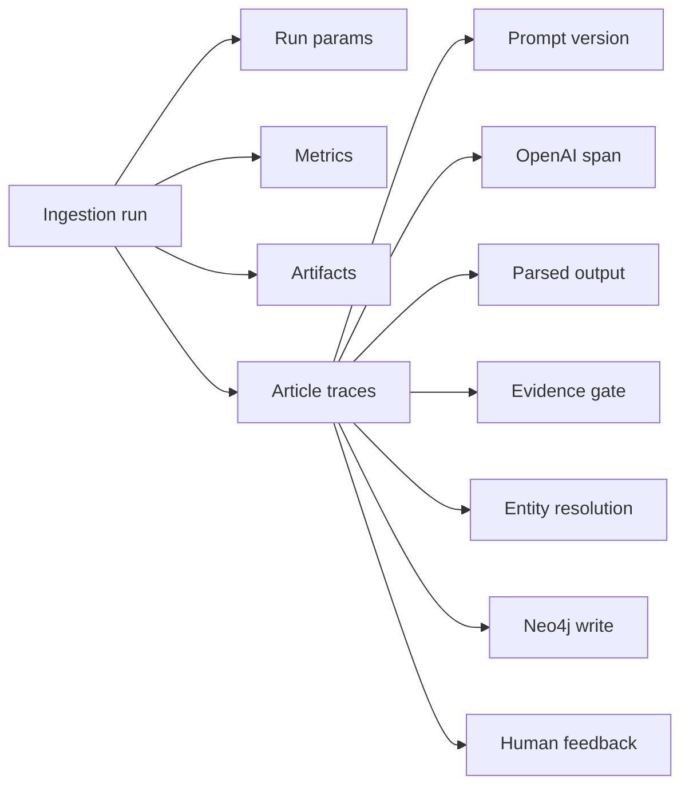

# Startup Radar

Startup Radar turns startup news into an evidence-backed knowledge graph with end-to-end LLM observability.

It scrapes startup news articles ([deutsche-startups.de](https://www.deutsche-startups.de),
a German startup news publication), extracts structured facts with an LLM,
normalizes and resolves entities, stores the resulting graph in Neo4j, and gives every article and
relationship a traceable audit trail in MLflow. The React frontend is built for
exploring the graph, inspecting evidence, and reviewing claims that need human
judgment.



## What It Does

Startup Radar extracts and connects:

| Entity | Examples |
| --- | --- |
| `Startup` | startups, scaleups, spinoffs |
| `Investor` | VC funds, angels, accelerators, corporate investors |
| `Person` | founders, executives, named partners |
| `Company` | acquirers and established companies |
| `Topic` | markets, technologies, sectors, funding stages |
| `Article` | processed source articles |
| `Source` | publishers and ingestion sources |

It writes relationship claims such as:

| Relationship | Direction |
| --- | --- |
| `INVESTED_IN` | investor/company/person -> startup |
| `FOUNDED_BY` | startup -> person |
| `ACQUIRED` | buyer/acquirer -> acquired startup/company |
| `MERGED_WITH` | startup/company -> startup/company |
| `EMPLOYED_BY` | person -> startup/company |
| `PARTNERED_WITH` | startup/company -> startup/company |
| `HAS_TOPIC` | entity -> topic |
| `MENTIONS` | article -> entity |
| `FROM_SOURCE` | article -> source |

Every persisted claim keeps evidence, source articles, lifecycle state, review
state, and MLflow trace references.

## Motivation

Startup ecosystem information is scattered across many articles. Funding rounds,
founders, acquisitions, investors, partnerships, and technology themes are often
present only as prose, making them hard to search, compare, or query across
time.

Startup Radar shows how a knowledge graph can turn that
unstructured data into structured, explorable information. Instead of
reading article by article, the graph view makes patterns visible: which
investors backed which startups, which companies are acquiring startups, which
topics are emerging, which claims are supported by which articles, and which
relationships need human review.

The project demonstrates a realistic and production-shaped full-stack AI workflow, not a
prompt-only demo. It includes the surrounding system that makes LLM extraction and knowledge graph usable:

| Concern | Implementation |
| --- | --- |
| Real input | Async article discovery, fetching, and parsing |
| Structured output | Delimiter-based extraction into Pydantic models |
| Evidence handling | `stated`, `attributed`, and `unsure` claim states |
| Safety gate | Only admitted extracted facts become supported graph claims |
| Entity resolution | Normalization, fuzzy matching, and optional embeddings |
| Provenance | Article URLs, evidence text, trace IDs, and trace links |
| Human review | Accept, reject, or reset graph claims |
| Observability | MLflow runs, traces, spans, prompts, artifacts, and feedback |
| Debugging | Raw extraction payloads, graph ops, failures, and audit output |

## Quick Start

### Prerequisites

- Docker and Docker Compose
- OpenAI API key

### 1. Configure Environment

```bash
cp .env.example .env
```

Set at least:

```bash
OPENAI_API_KEY=your_api_key_here
```

### 2. Start The Stack

```bash
docker compose up --build
```

### 3. Open The App

| Service | URL |
| --- | --- |
| Frontend | http://localhost:5173 |
| Backend health | http://localhost:8000/health |
| MLflow | http://localhost:5001 |
| Neo4j Browser | http://localhost:7474 |

Neo4j development login:

```text
username: neo4j
password: startup-radar
```

## Demo Flow

1. Open the frontend at `http://localhost:5173`.
2. Start an ingestion run.
3. Watch progress as articles are collected, extracted, resolved, and written.
4. Search for a startup, investor, person, company, or topic.
5. Click graph nodes to inspect focused subgraphs and claim provenance.
6. Review relationships marked as suspicious or conflicting.
7. Open the related MLflow trace to inspect the exact prompt, response, parser
   output, evidence gate, resolver decisions, and graph write.

## AI Workflow



### Pipeline Stages

| Stage | Purpose |
| --- | --- |
| Scraping | Collect article links, fetch HTML, extract clean metadata and body text |
| LLM extraction | Extract entities and relationships in a strict structured format |
| Gleaning | Optional follow-up pass for missed or malformed records |
| Parsing | Convert raw model output into typed Pydantic records |
| Evidence gate | Admit `stated` and `attributed`; quarantine `unsure` |
| Entity resolution | Merge duplicates through exact, fuzzy, and embedding-based matching |
| Graph write | Persist entities, article support, claims, evidence, and provenance |
| Review | Mark conflicting or changed claims and allow human decisions |
| Observability | Attach run metrics, trace spans, prompt versions, artifacts, and feedback |

## Claim Lifecycle



Review is deliberately claim-level. A rejected relationship is hidden from graph
views, while accepted claims keep their support and provenance.

## Data Model



Claim relationships store:

- `evidence_status`
- `evidence`
- `keywords`
- `article_urls` and `active_article_urls`
- `article_titles`
- `lifecycle_status`
- `review_status`
- `review_reasons`
- `review_history`
- provenance entries with article, trace, run, and timestamp metadata

## Observability With MLflow

MLflow is the audit layer for the AI workflow.



Run-level tracking includes source settings, model configuration, prompt URIs,
article counts, extraction counts, evidence counts, graph operation totals,
entity resolution outcomes, token usage, and latency.

Article traces include:

| Span | What to inspect |
| --- | --- |
| `process_article` | Root trace for one article |
| `extract_entities` | LLM orchestration and extraction audit |
| OpenAI chat span | Prompt, response, tokens, model metadata |
| `gleaning_pass` | Follow-up extraction corrections |
| `parse_extraction_response` | Raw delimiter rows to typed output |
| `evidence_gate` | Claims admitted or dropped |
| `resolve_entities` | Batch entity resolution summary |
| `resolve_entity` | Exact/fuzzy/embedding decision for one entity |
| `write_to_neo4j` | Graph write operation count |

Run artifacts include:

| Artifact | Contents |
| --- | --- |
| `ingestion_summary.md` | Human-readable ingestion summary |
| `extraction_summary.jsonl` | Per-article extraction counts |
| `graph_ops.jsonl` | Per-article graph write results |
| `extraction_dump.jsonl` | Structured extraction payloads |
| `failed_articles.jsonl` | Failed article URLs and errors |
| `dedup_report.json` | Entity resolution outcomes |

## Prompt Registry

When `MLFLOW_USE_PROMPT_REGISTRY=true`, the backend syncs local prompt templates
to MLflow Prompt Registry at startup and loads the configured aliases:

| Variable | Default |
| --- | --- |
| `MLFLOW_PROMPT_EXTRACTION_URI` | `prompts:/article_extraction@champion` |
| `MLFLOW_PROMPT_GLEANING_URI` | `prompts:/article_extraction_gleaning@champion` |

The extraction prompt and gleaning prompt are linked to traces when loaded from
the registry, so each article trace can be tied back to the prompt version that
created it.

## Repository Layout

```text
.
|-- backend/
|   |-- app/
|   |   |-- api/              # FastAPI routes
|   |   |-- core/             # settings, logging, app config
|   |   |-- db/               # Neo4j client and schema
|   |   |-- models/           # Pydantic contracts
|   |   |-- observability/    # MLflow setup, runs, artifacts, feedback
|   |   |-- prompts/          # extraction and gleaning prompts
|   |   |-- graph/            # graph persistence and queries
|   |   `-- services/         # scraping, LLM, ingestion, resolution
|   |-- Dockerfile
|   `-- pyproject.toml
|-- frontend/
|   |-- src/
|   |   |-- components/       # graph canvas, panels, controls
|   |   |-- lib/              # API client and helpers
|   |   `-- types/            # frontend contracts
|   |-- Dockerfile
|   `-- package.json
|-- docker-compose.yml
|-- .env.example
`-- README.md
```

## Configuration

Important environment variables:

| Variable | Purpose |
| --- | --- |
| `OPENAI_API_KEY` | Required for extraction |
| `OPENAI_MODEL` | Chat model used for extraction |
| `LLM_MAX_CONCURRENCY` | Number of concurrent article extractions |
| `LLM_TIMEOUT_SECONDS` | Timeout per LLM request |
| `LLM_RETRY_ATTEMPTS` | Application-level extraction retries |
| `LLM_GLEANING_PASSES` | Additional extraction review passes |
| `EMBEDDING_PROVIDER` | `openai` or `sentence-transformers` |
| `EMBEDDING_MODEL` | OpenAI embedding model |
| `ENABLE_EMBEDDING_RESOLUTION` | Enables Neo4j vector matching |
| `EMBEDDING_SIMILARITY_THRESHOLD` | Minimum vector match score |
| `NEO4J_URI` | Neo4j Bolt URI |
| `MLFLOW_ENABLED` | Enables MLflow tracing and tracking |
| `MLFLOW_TRACKING_URI` | Backend-facing MLflow tracking URI |
| `MLFLOW_PUBLIC_URL` | Browser-facing MLflow URL used in trace links |
| `MLFLOW_USE_PROMPT_REGISTRY` | Loads prompts from MLflow Prompt Registry |
| `SCRAPE_TIMEOUT_SECONDS` | Per-request scraping timeout |
| `MAX_ARTICLES_PER_INGEST` | Hard cap for one ingestion job |

See [.env.example](./.env.example) for the full local configuration.

## Local Development

Local development outside Docker expects:

- Python 3.12 or newer
- `uv`
- Node.js 22 or newer

Run infrastructure in Docker:

```bash
docker compose up neo4j mlflow
```

Run the backend locally:

```bash
cd backend
uv run uvicorn app.main:app --reload
```

Run the frontend locally:

```bash
cd frontend
npm install
npm run dev
```

## Useful Commands

Start everything:

```bash
docker compose up --build
```

Stop everything:

```bash
docker compose down
```

Rebuild backend after Python or prompt changes:

```bash
docker compose up --build backend
```

Frontend build:

```bash
cd frontend
npm run build
```

Backend lint:

```bash
cd backend
uv run --extra dev ruff check app
```

Backend tests:

```bash
cd backend
uv run --extra dev pytest
```

Clear the graph:

```bash
curl -X DELETE http://localhost:8000/graph
```

## API Reference

| Method | Path | Purpose |
| --- | --- | --- |
| `GET` | `/health` | App and database health |
| `POST` | `/schema/apply` | Apply Neo4j schema |
| `POST` | `/ingest` | Start an async ingestion job |
| `GET` | `/ingest/{task_id}` | Poll ingestion status |
| `GET` | `/graph` | Fetch graph data |
| `DELETE` | `/graph` | Clear all graph data |
| `GET` | `/search?q=...` | Search graph entities |
| `GET` | `/nodes/{node_id}/claims` | Inspect claims for one node |
| `POST` | `/claims/review` | Accept, reject, or reset a claim |
| `GET` | `/startup/{name}` | Fetch a startup profile |
| `GET` | `/investor/{name}` | Fetch an investor-like profile |
| `GET` | `/insights/trending-startups` | Recently active startups |
| `GET` | `/insights/top-investors` | Most connected investors |
| `GET` | `/insights/co-investments` | Investor overlap signals |
| `GET` | `/insights/topic-clusters` | Topic/entity clusters |
| `POST` | `/traces/{trace_id}/feedback` | Attach human feedback to a trace |
| `GET` | `/metrics` | Prometheus metrics |

## Frontend Features

- Force-directed graph exploration
- Search-driven focused subgraphs
- Landscape and article-feed graph views
- Entity detail panel with relationships and article support
- Claim filters for review, supported, and all claims
- Human review actions for suspicious claims
- Raw extraction and article provenance inspection
- Direct MLflow trace links from claims and articles
- Market pulse panels for trending startups, top investors, co-investments,
  and topic clusters


## Debugging A Claim

When a graph relationship looks wrong, follow the evidence path:

1. Open the claim in the frontend.
2. Read the evidence sentence and supporting article list.
3. Open the MLflow trace from the claim.
4. Check the OpenAI response to see what the model produced.
5. Check `parse_extraction_response` to see what was parsed.
6. Check `evidence_gate` to see why the claim was admitted.
7. Check entity resolution spans to see whether endpoints were merged correctly.
8. Accept, reject, or reset the claim from the review controls.

That workflow is the core product idea: every graph edge should be inspectable,
reviewable, and traceable back to the article and AI workflow that created it.
