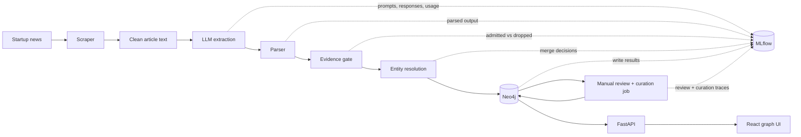
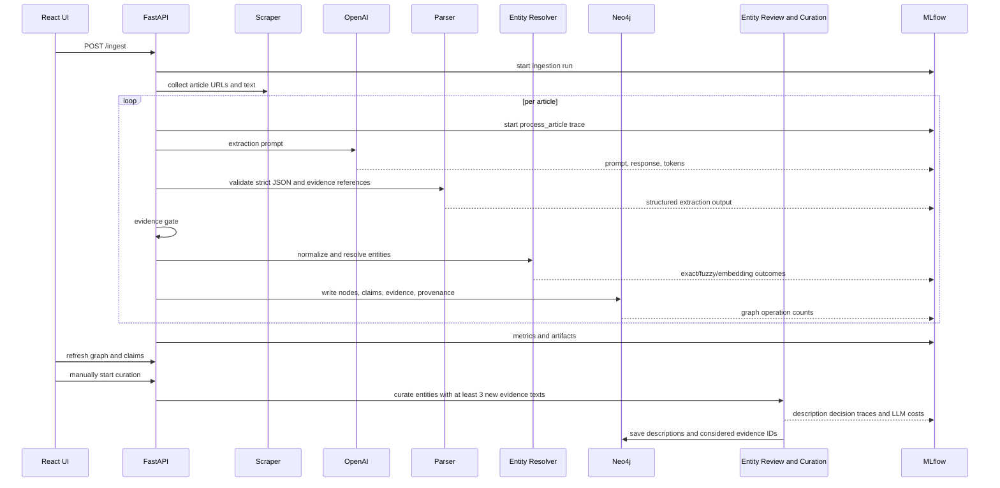
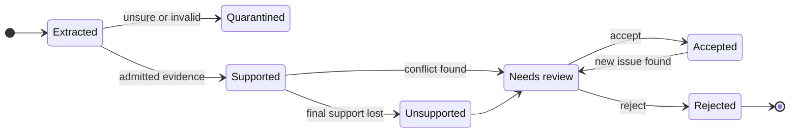
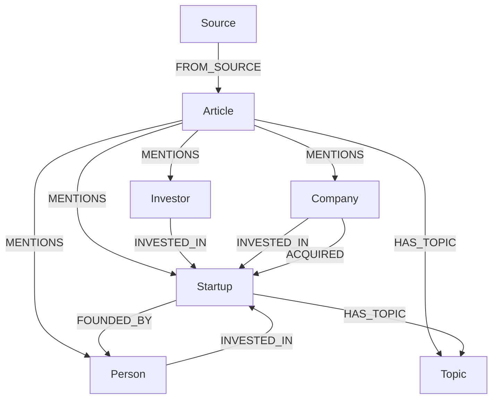
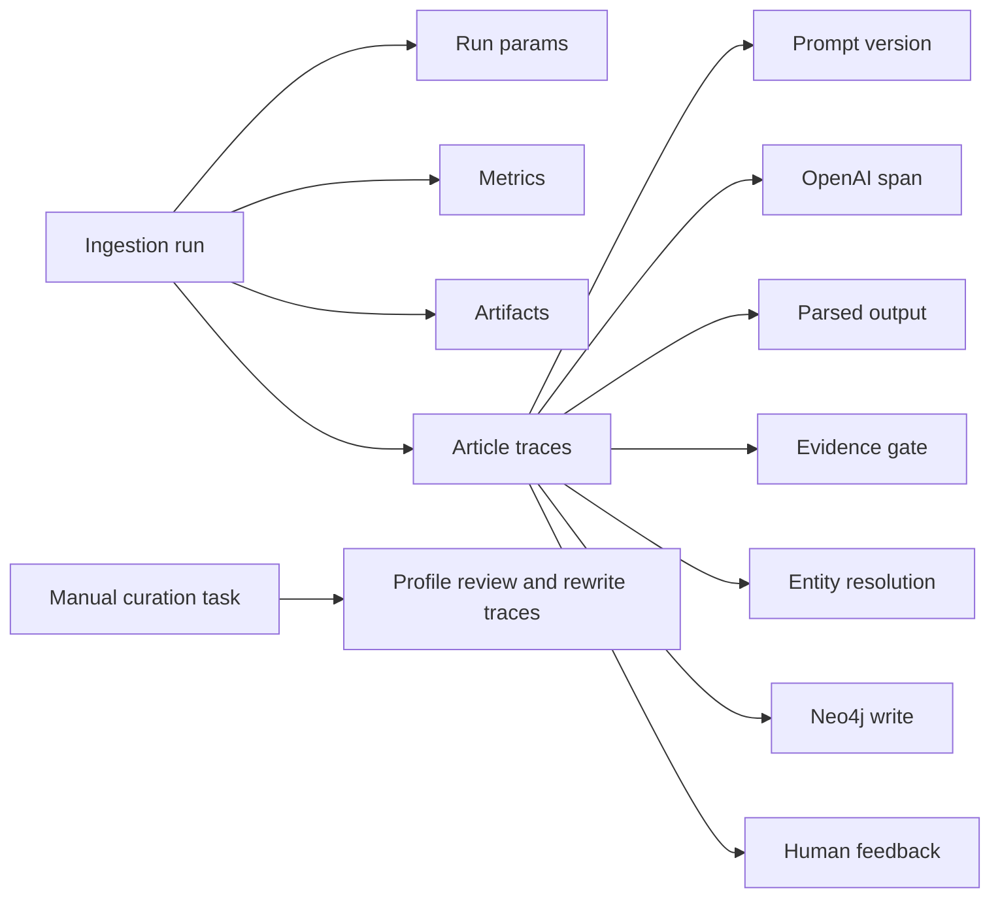

# Startup Radar

[](https://github.com/chenkel-data/Startup-Radar/actions/workflows/ci.yml)
[](backend/pyproject.toml)
[](frontend/package.json)
[](https://fastapi.tiangolo.com/)
[](https://react.dev/)
[](https://neo4j.com/)
[](https://mlflow.org/)
[](LICENSE)
[](https://medium.com/@christopher.henkel.ai/from-llm-output-to-reliable-knowledge-building-startup-radar-1e1256fd8ca9)

Startup Radar turns startup news into an evidence-backed knowledge graph with end-to-end LLM observability.

It scrapes startup news articles ([deutsche-startups.de](https://www.deutsche-startups.de),
a German startup news publication), extracts structured facts with an LLM,
normalizes and resolves entities, stores the resulting graph in Neo4j, and gives every article and
relationship a traceable audit trail in MLflow. The React frontend is built for
exploring the graph, inspecting evidence, and reviewing claims that need human
judgment.


```mermaid
flowchart LR
  News[Startup news] --> Scraper[Scraper]
  Scraper --> Articles[Clean article text]
  Articles --> LLM[LLM extraction]
  LLM --> Parser[Parser]
  Parser --> Gate[Evidence gate]
  Gate --> Resolver[Entity resolution]
  Resolver --> Graph[(Neo4j)]
  Graph --> DescriptionCheck[Manual review + curation job]
  DescriptionCheck --> Graph
  Graph --> API[FastAPI]
  API --> UI[React graph UI]

  LLM -. prompts, responses, usage .-> MLflow[(MLflow)]
  Parser -. parsed output .-> MLflow
  Gate -. admitted vs dropped .-> MLflow
  Resolver -. merge decisions .-> MLflow
  Graph -. write results .-> MLflow
  DescriptionCheck -. review + curation traces .-> MLflow
```

## What It Does

Startup Radar extracts and connects:

| Entity | Examples |
| --- | --- |
| `Startup` | startups, scaleups, spinoffs |
| `Investor` | VC funds, angels, accelerators, corporate investors |
| `Person` | founders, executives, named partners |
| `Company` | acquirers and established companies |
| `Topic` | markets, technologies, sectors, funding stages |
| `Article` | processed source articles |
| `Source` | publishers and ingestion sources |

It writes relationship claims such as:

| Relationship | Direction |
| --- | --- |
| `INVESTED_IN` | investor/company/person -> startup |
| `FOUNDED_BY` | startup -> person |
| `ACQUIRED` | buyer/acquirer -> acquired startup/company |
| `MERGED_WITH` | startup/company -> startup/company |
| `EMPLOYED_BY` | person -> startup/company |
| `PARTNERED_WITH` | startup/company -> startup/company |
| `HAS_TOPIC` | entity -> topic |
| `MENTIONS` | article -> entity |
| `FROM_SOURCE` | article -> source |

Every persisted claim keeps evidence, source articles, lifecycle state, review
state, and MLflow trace references.

Entity descriptions can be reviewed in a separate, manually started AI curation
job. An entity profile is the source-backed description and related metadata
(including evidence and traces) attached to a startup, investor, person,
company, or topic.

Profiles are revised as more evidence arrives. A profile created from one article
may be incomplete, too closely reflect that article's angle, or become stale over
time. The curation step compares new article evidence with the current profile
and decides whether to keep it, update it, or flag it for human review. It runs
only when explicitly started and an entity has at least three distinct new
evidence texts. Evidence is permanently cached by its stable evidence ID after
consideration, so the same evidence is not reviewed again. A curation policy
hash also limits each job to evidence ingested under the active prompts and
model settings.


## Motivation

### Connecting the dots.


Startup ecosystems move fast, and the pieces of information are scattered across
articles and time. Who founded a company, who backed it, what it is building, who it partners with,
and how its story changes over time usually requires connecting separate pieces of information into a coherent view.


Startup Radar shows how a knowledge graph can turn that scattered and 
unstructured article data into structured, explorable information. It connects articles, entities, relationship
claims, and sources so users can trace where information came from, see how
companies, people, and investors relate to one another, and review claims that
need human judgment.

The project demonstrates a realistic and production-shaped full-stack AI workflow, not a
prompt-only demo. It includes the surrounding system that makes LLM extraction and knowledge graphs actually usable:

| Concern | Implementation |
| --- | --- |
| Real input | Async article discovery, fetching, and parsing |
| Structured output | Strict JSON Schema extraction with article evidence references |
| Evidence handling | `stated`, `attributed`, and `unsure` claim states |
| Safety gate | Only admitted extracted facts become supported graph claims |
| Entity resolution | Normalization, fuzzy matching, and optional embeddings |
| Entity curation | Manual batched review of entity profiles (update, keep, or flag) |
| Provenance | Article URLs, evidence text, trace IDs, and trace links |
| Human review | Accept, reject, or reset graph claims |
| Observability | MLflow runs, traces, spans, prompts, artifacts, and feedback |
| Debugging | Raw extraction payloads, graph ops, failures, and audit output |

## Quick Start

### Prerequisites

- Docker and Docker Compose
- OpenAI API key

### 1. Configure Environment

```bash
cp .env.example .env
```

Set at least:

```bash
OPENAI_API_KEY=your_api_key_here
```

### 2. Start The Stack

```bash
docker compose up --build
```

### 3. Open The App

| Service | URL |
| --- | --- |
| Frontend | http://localhost:5173 |
| Backend health | http://localhost:8000/health |
| MLflow | http://localhost:5001 |
| Neo4j Browser | http://localhost:7474 |

Neo4j development login:

```text
username: neo4j
password: startup-radar
```

## Demo Flow

1. Open the frontend at `http://localhost:5173`.
2. Start an ingestion run.
3. Watch progress as articles are collected, extracted, resolved, and written.
4. Search for a startup, investor, person, company, or topic.
5. Click graph nodes to inspect focused subgraphs and claim provenance.
6. Review relationships marked as suspicious or conflicting.
7. Open the related MLflow trace to inspect the exact prompt, response, parser
   output, evidence gate, resolver decisions, and graph write.

## AI Workflow


```mermaid
sequenceDiagram
  participant UI as React UI
  participant API as FastAPI
  participant Scraper as Scraper
  participant LLM as OpenAI
  participant Parser as Parser
  participant Resolver as Entity Resolver
  participant Neo4j as Neo4j
  participant Descriptions as Entity Review and Curation
  participant MLflow as MLflow

  UI->>API: POST /ingest
  API->>MLflow: start ingestion run
  API->>Scraper: collect article URLs and text

  loop per article
    API->>MLflow: start process_article trace
    API->>LLM: extraction prompt
    LLM-->>MLflow: prompt, response, tokens
    API->>Parser: validate strict JSON and evidence references
    Parser-->>MLflow: structured extraction output
    API->>API: evidence gate
    API->>Resolver: normalize and resolve entities
    Resolver-->>MLflow: exact/fuzzy/embedding outcomes
    API->>Neo4j: write nodes, claims, evidence, provenance
    Neo4j-->>MLflow: graph operation counts
  end

  API->>MLflow: metrics and artifacts
  UI->>API: refresh graph and claims
  UI->>API: manually start curation
  API->>Descriptions: curate entities with at least 3 new evidence texts
  Descriptions-->>MLflow: description decision traces and LLM costs
  Descriptions->>Neo4j: save descriptions and considered evidence IDs
```

### Pipeline Stages

| Stage | Purpose |
| --- | --- |
| Scraping | Collect article links, fetch HTML, extract clean metadata and body text |
| LLM extraction | Extract entities and relationships in a strict structured format |
| Gleaning | Optional recall-only pass for missed supported records |
| Parsing | Convert raw model output into typed Pydantic records |
| Evidence gate | Admit `stated` and `attributed`; quarantine `unsure` |
| Entity resolution | Merge duplicates through exact, fuzzy, and embedding-based matching |
| Graph write | Persist entities, claims, article support, and provenance |
| Entity curation | Manually review batches with at least three distinct new evidence texts |
| Human review | Mark conflicting or changed claims and allow human decisions |
| Observability | Attach run metrics, trace spans, prompt versions, artifacts, and feedback |

## Claim Lifecycle


```mermaid
stateDiagram-v2
  direction LR
  state "Needs review" as NeedsReview

  [*] --> Extracted
  Extracted --> Quarantined: unsure or invalid
  Extracted --> Supported: admitted evidence
  Supported --> NeedsReview: conflict found
  Supported --> Unsupported: final support lost
  Unsupported --> NeedsReview
  NeedsReview --> Accepted: accept
  NeedsReview --> Rejected: reject
  Accepted --> NeedsReview: new issue found
  Rejected --> [*]
```

A relationship stays supported while at least one active article still
reproduces it. Losing the final active source marks the claim unsupported and
queues it for review. Conflicts can queue review while the claim remains
supported.

Review is claim-level. A rejected relationship is hidden from graph
views, while accepted claims keep their support and provenance.

### Relationship Review Cases

The review tab keeps each relationship card focused on the current decision:
keep the relationship, reject it, or reset a previous decision. A card shows the
relationship, why it needs attention, the article that caused the state, one
evidence quote, and the available actions. Full extraction history stays in the
trace and provenance views.

- `Missing in latest extraction`: the final active source no longer produced
  this relationship in the latest run.
- `Direction changed`: the final active source now produced the same
  relationship in the opposite direction.
- `Conflicting direction`: both directions are active in the graph.
- `Competing claim`: the same entities have incompatible relationship types,
  such as `ACQUIRED` and `MERGED_WITH`.
- `Supported`: the relationship still has current article support.
- `Accepted`: a reviewer confirmed the relationship.
- `Rejected`: a reviewer rejected the relationship, so it is hidden from graph
  views unless it is reset.

## (Graph-) Data Model


```mermaid
flowchart TD
  Source[Source] -->|FROM_SOURCE| Article[Article]
  Article -->|MENTIONS| Startup[Startup]
  Article -->|MENTIONS| Investor[Investor]
  Article -->|MENTIONS| Person[Person]
  Article -->|MENTIONS| Company[Company]
  Article -->|HAS_TOPIC| Topic[Topic]

  Investor -->|INVESTED_IN| Startup
  Company -->|INVESTED_IN| Startup
  Person -->|INVESTED_IN| Startup
  Startup -->|FOUNDED_BY| Person
  Company -->|ACQUIRED| Startup
  Startup -->|HAS_TOPIC| Topic
```


## Observability With MLflow

MLflow is the audit layer for the AI workflow.


```mermaid
flowchart LR
  Run[Ingestion run] --> A[Run params]
  Run --> M[Metrics]
  Run --> Artifacts[Artifacts]
  Run --> Traces[Article traces]

  Traces --> Prompt[Prompt version]
  Traces --> Model[OpenAI span]
  Traces --> Parsed[Parsed output]
  Traces --> Gate[Evidence gate]
  Traces --> Resolve[Entity resolution]
  Traces --> Write[Neo4j write]
  Traces --> Feedback[Human feedback]
  CurationJob[Manual curation task] --> CurationTraces[Profile review and rewrite traces]
```

Run-level tracking includes source settings, model configuration, prompt URIs,
article counts, extraction counts, evidence counts, graph operation totals,
entity resolution outcomes, token usage, estimated LLM cost, and latency. LLM
cost metrics are split by workflow step, including extraction, gleaning, and
entity curation.

For MLflow's GenAI Overview dashboard, Startup Radar labels OpenAI spans with
the workflow step, such as `gpt-4.1-mini / extraction`, so costs can be compared
across extraction, gleaning, profile review, and profile curation. It also labels
the same spans with a per-model total, such as `gpt-4.1-mini / total`, so the
dashboard can show total model cost.

Article traces include:

| Span | What to inspect |
| --- | --- |
| `process_article` | Root trace for one article |
| `extract_entities` | LLM orchestration and extraction audit |
| `OpenAI chat span` | Prompt, response, tokens, model metadata |
| `gleaning_pass` | Recall-only audit for missed supported facts |
| `parse_extraction_response` | Strict JSON records to evidence-validated typed output |
| `evidence_gate` | Claims admitted or dropped |
| `resolve_entities` | Batch entity resolution summary |
| `resolve_entity` | Exact/fuzzy/embedding decision for one entity |
| `write_to_neo4j` | Graph write operation count |

Run artifacts include:

| Artifact | Contents |
| --- | --- |
| `ingestion_summary.md` | Human-readable ingestion summary |
| `extraction_summary.jsonl` | Per-article extraction counts |
| `graph_ops.jsonl` | Per-article graph write results |
| `extraction_dump.jsonl` | Structured extraction payloads |
| `llm_costs.jsonl` | Per-LLM-call token and cost rows by workflow step |
| `failed_articles.jsonl` | Failed article URLs and errors |
| `dedup_report.json` | Entity resolution outcomes |

## Prompt Registry

When `MLFLOW_USE_PROMPT_REGISTRY=true`, the backend syncs local prompt templates
to MLflow Prompt Registry at startup and loads the configured aliases:

| Variable | Default |
| --- | --- |
| `MLFLOW_PROMPT_EXTRACTION_URI` | `prompts:/article_extraction@champion` |
| `MLFLOW_PROMPT_GLEANING_URI` | `prompts:/article_extraction_gleaning@champion` |
| `MLFLOW_PROMPT_PROFILE_REVIEW_URI` | `prompts:/entity_profile_review@champion` |
| `MLFLOW_PROMPT_PROFILE_CURATION_URI` | `prompts:/entity_profile_curation@champion` |

Extraction, gleaning, entity review and curation prompts are
linked to traces when loaded from the registry, so each article or decision can be tied back to the prompt version that created it.

## Repository Layout

```text
.
|-- backend/
|   |-- app/
|   |   |-- api/              # FastAPI routes
|   |   |-- core/             # settings, logging, app config
|   |   |-- db/               # Neo4j client and schema
|   |   |-- models/           # Pydantic contracts
|   |   |-- observability/    # MLflow setup, runs, artifacts, feedback
|   |   |-- prompts/          # extraction and gleaning prompts
|   |   |-- graph/            # graph persistence and queries
|   |   `-- services/         # scraping, LLM, ingestion, resolution
|   |-- Dockerfile
|   `-- pyproject.toml
|-- frontend/
|   |-- src/
|   |   |-- components/       # graph canvas, panels, controls
|   |   |-- lib/              # API client and helpers
|   |   `-- types/            # frontend contracts
|   |-- Dockerfile
|   `-- package.json
|-- docker-compose.yml
|-- .env.example
`-- README.md
```

## Configuration

Important environment variables:

| Variable | Purpose |
| --- | --- |
| `OPENAI_API_KEY` | Required for extraction |
| `OPENAI_MODEL` | Chat model used for extraction |
| `LLM_MAX_CONCURRENCY` | Number of concurrent article extractions |
| `LLM_TIMEOUT_SECONDS` | Timeout per LLM request |
| `LLM_RETRY_ATTEMPTS` | Application-level extraction retries |
| `LLM_GLEANING_PASSES` | Additional extraction review passes |
| `ENABLE_ENTITY_DESCRIPTION_CURATION` | Enables manual profile curation and evidence policy stamping |
| `ENTITY_CURATION_MAX_CONCURRENCY` | Maximum parallel profile reviews |
| `EMBEDDING_PROVIDER` | `openai` or `sentence-transformers` |
| `EMBEDDING_MODEL` | OpenAI embedding model |
| `ENABLE_EMBEDDING_RESOLUTION` | Enables Neo4j vector matching |
| `EMBEDDING_SIMILARITY_THRESHOLD` | Minimum vector match score |
| `NEO4J_URI` | Neo4j Bolt URI |
| `MLFLOW_ENABLED` | Enables MLflow tracing and tracking |
| `MLFLOW_TRACKING_URI` | Backend-facing MLflow tracking URI |
| `MLFLOW_PUBLIC_URL` | Browser-facing MLflow URL used in trace links |
| `MLFLOW_USE_PROMPT_REGISTRY` | Loads prompts from MLflow Prompt Registry |
| `MLFLOW_PROMPT_PROFILE_REVIEW_URI` | Prompt Registry URI for profile review |
| `MLFLOW_PROMPT_PROFILE_CURATION_URI` | Prompt Registry URI for writing updated descriptions |
| `SCRAPE_TIMEOUT_SECONDS` | Per-request scraping timeout |

See [.env.example](./.env.example) for the full local configuration.

## Local Development

Local development outside Docker expects:

- Python 3.12 or newer
- `uv`
- Node.js 22 or newer

Run infrastructure in Docker:

```bash
docker compose up neo4j mlflow
```

Run the backend locally:

```bash
cd backend
uv run uvicorn app.main:app --reload
```

Run the frontend locally:

```bash
cd frontend
npm install
npm run dev
```

## Useful Commands

Start everything:

```bash
docker compose up --build
```

Stop everything:

```bash
docker compose down
```

Rebuild backend after Python or prompt changes:

```bash
docker compose up --build backend
```

Frontend build:

```bash
cd frontend
npm run build
```

Backend lint:

```bash
cd backend
uv run --extra dev ruff check app
```

Backend tests:

```bash
cd backend
uv run --extra dev pytest
```

Clear the graph:

```bash
curl -X DELETE http://localhost:8000/graph
```

## API Reference

| Method | Path | Purpose |
| --- | --- | --- |
| `GET` | `/health` | App and database health |
| `POST` | `/schema/apply` | Apply Neo4j schema |
| `POST` | `/ingest` | Start an async ingestion job |
| `GET` | `/ingest/{task_id}` | Poll ingestion status |
| `GET` | `/graph` | Fetch landscape, focused, or article-feed graph data |
| `DELETE` | `/graph` | Clear all graph data |
| `GET` | `/entities/counts` | Count graph entities by type |
| `GET` | `/search?q=...` | Search graph entities |
| `GET` | `/nodes/{node_id}/claims` | Inspect claims for one node |
| `POST` | `/claims/review` | Accept, reject, or reset a claim |
| `GET` | `/startup/{name}` | Fetch a startup profile |
| `GET` | `/investor/{name}` | Fetch an investor-like profile |
| `GET` | `/insights/trending-startups` | Recently active startups |
| `GET` | `/insights/top-investors` | Most connected investors |
| `GET` | `/insights/co-investments` | Investor overlap signals |
| `GET` | `/insights/topic-clusters` | Topic/entity clusters |
| `POST` | `/traces/{trace_id}/feedback` | Attach human feedback to a trace |
| `GET` | `/metrics` | Prometheus metrics |

## Frontend Features

- Force-directed graph exploration
- Search-driven focused subgraphs
- Node and relationship filters with current graph counts
- Entity detail panel with relationships and article support
- Compact relationship cards for review, supported, accepted, and rejected claims
- Human review actions for suspicious, changed, and conflicting claims
- Entity profile status and MLflow trace links
- Latest article extraction traces for selected entity
- Direct MLflow trace links from claims and articles
- Market pulse panels for trending startups, top investors, co-investments,
  and topic clusters

## Debugging A Claim

When a graph relationship looks wrong, follow the evidence path:

1. Open the claim in the frontend.
2. Read the review state, source article, and evidence sentence.
3. Open the MLflow trace from the claim.
4. Check the OpenAI response to see what the model produced.
5. Check `parse_extraction_response` to see what was parsed.
6. Check `evidence_gate` to see why the claim was admitted.
7. Check entity resolution spans to see whether entities were merged correctly.
8. Accept, reject, or reset the claim from the review controls.

That workflow is the core product idea: every graph edge should be inspectable,
reviewable, and traceable back to the article and AI workflow that created it.

## Debugging An Entity Profile

When an entity description looks wrong or stale:

1. Open the entity in the frontend.
2. Check the description status under the entity name.
3. Open the linked MLflow trace.
4. Inspect `profile_evidence_context` for the article evidences used.
5. Inspect `review_entity_profile` for the keep, update, or flag decision.
6. If the description changed, inspect `curate_entity_profile` for the new text.

Profile curation is manual and policy-aware. Evidence must have been ingested
under the active policy and an entity must have at least three distinct,
not-yet-considered evidence texts. Once an evidence ID has been considered, it
is not reviewed again, including after a policy change.
